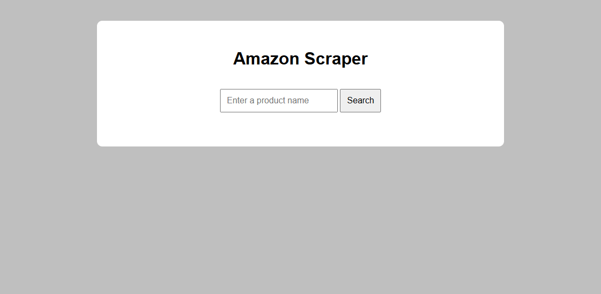
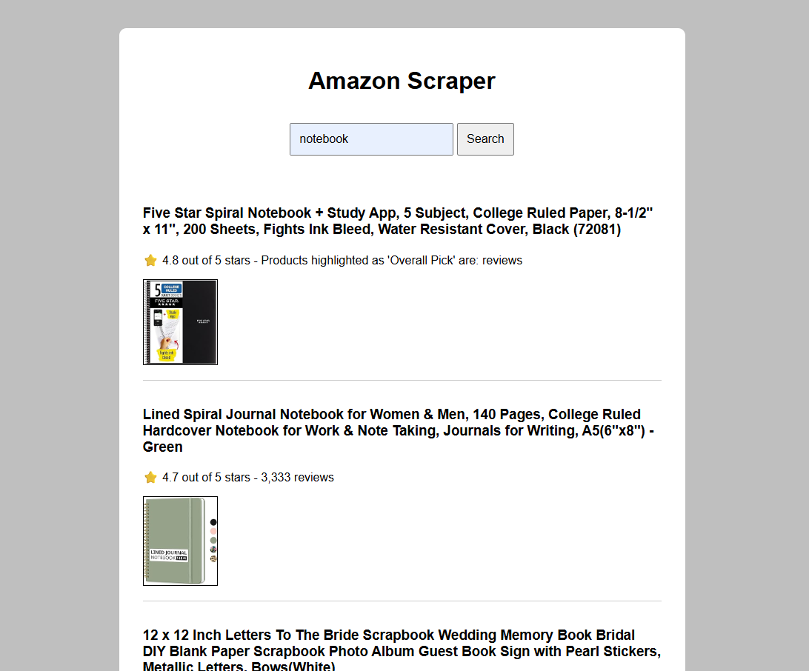

# 🛍️ Amazon Product Scraper

Este projeto é uma aplicação web completa que realiza **scraping de produtos da Amazon** com base em uma palavra-chave buscada pelo usuário.  
Ele foi desenvolvido como parte de um desafio técnico para demonstrar habilidades com **Bun**, **Express**, **JSDOM**, **Axios**, **Vite**, **HTML**, **CSS** e **JavaScript puro**.

---

## 📸 Demonstração




---

## ✨ Funcionalidades

- 🔍 Campo de busca por palavra-chave
- 📦 Extração (scraping) de produtos da Amazon em tempo real
- ⭐ Coleta de:
  - Título do produto
  - Avaliação (estrelas)
  - Número de reviews
  - URL da imagem do produto
- 📃 Exibição dos resultados em um layout limpo e responsivo
- 💥 Tratamento de erros para buscas vazias ou falhas de conexão

---

## 🧰 Tecnologias utilizadas

### Backend (API)

- [Bun](https://bun.sh/) – Runtime do JavaScript/TypeScript
- [Express](https://expressjs.com/) – Servidor HTTP
- [Axios](https://axios-http.com/) – Requisições HTTP
- [JSDOM](https://github.com/jsdom/jsdom) – Manipulação de HTML do lado do servidor
- [CORS](https://expressjs.com/en/resources/middleware/cors.html) – Para permitir chamadas entre front e back

### Frontend

- [Vite](https://vitejs.dev/) – Dev server rápido
- HTML + CSS + JavaScript vanilla (sem frameworks)

---

## 🛠️ Como instalar e executar o projeto localmente

> 📌 Requisitos:
>
> - Node.js (para o frontend)
> - [Bun instalado](https://bun.sh/docs/installation) (para o backend)

---

### 🚀 Clonando o projeto

```bash
git clone https://github.com/Tjaos/amazon-scraper-web.git
cd amazon-scraper-web
```

---

### 🖥️ Backend (API com Bun)

```bash
cd backend
bun install
bun index.ts
```

O backend estará disponível em:  
👉 http://localhost:3000/api/

Se quiser procurar pela plaavra-chave:
👉 http://localhost:3000/api/scrape?keyword={notebook} (por exemplo)

---

### 💻 Frontend (Vite)

Em outro terminal:

```bash
cd frontend
npm install
npm run dev
```

O frontend estará disponível em:  
👉 http://localhost:5173

---

### 🧪 Testando

1. Acesse `http://localhost:5173`
2. Digite um termo no campo de busca (ex: `notebook`)
3. Clique em **Buscar**
4. Veja os resultados da primeira página da Amazon!

---

## ⚠️ Avisos importantes

- A Amazon pode bloquear ou limitar requisições automatizadas.
- Este projeto é apenas para **fins educacionais e desafio de código**. Não utilize em produção ou para automações reais.
- O scraping é feito via requisição HTTP simulando um navegador (com `User-Agent`).
- A estrutura da Amazon pode mudar, então o scraper pode quebrar futuramente.

---

## 🧑‍💻 Autor

**Thiago Amaral**  
Desenvolvedor Full Stack  
[LinkedIn](https://www.linkedin.com/in/thiagoamaraldev/) | [GitHub](https://github.com/Tjaos)

---

## 📄 Licença

Este projeto está licenciado sob a licença MIT.  
Sinta-se livre para usar, estudar e modificar com fins educacionais.

---

## 📬 Sugestões ou dúvidas?

Fique à vontade para abrir uma **issue** ou entrar em contato!
